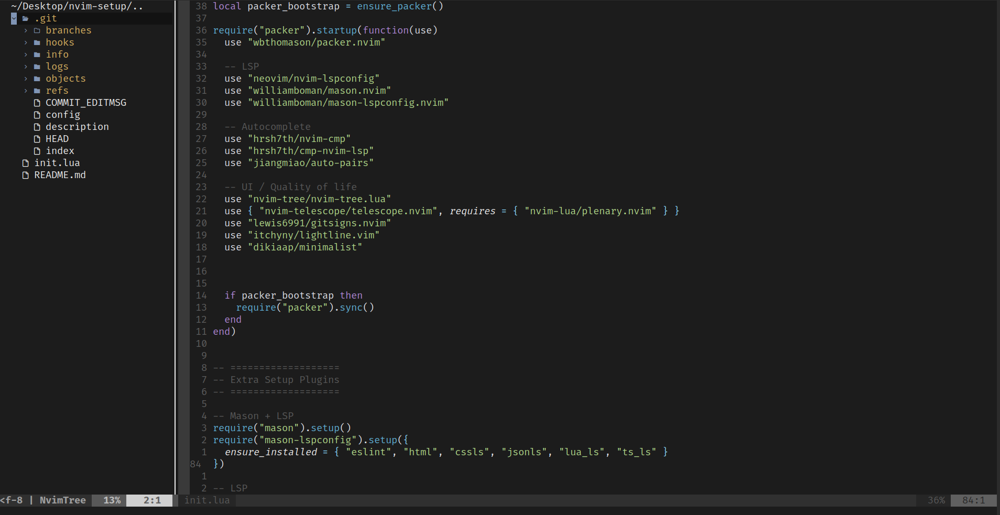

# 🖤 Neovim Config for React & Node


Welcome to my **clean and lightweight Neovim configuration** optimized for **React** and **Node.js** development! 🚀

This setup includes LSP, autocompletion, Telescope, Git integration, Nvim-Tree, and a minimal colorscheme—everything you need for an efficient workflow.

<p align="center">
  
</p>

---

## 🔹 Features

- **💡 Core Settings**
  - Leader key set to `,`
  - Relative and absolute line numbers
  - Mouse support in all modes
  - System clipboard integration (`unnamedplus`)
  - Tab width: 2 spaces (ideal for JavaScript / TypeScript)

- **🖥️ UI / Appearance**
  - Minimalist colorscheme
  - Nvim-Tree file explorer (no icons, clean look)
  - Lightline for a simple statusline
  - True color support enabled

- **⚡ Productivity**
  - LSP setup with `tsserver`, `eslint`, `html`, `cssls`, `jsonls`, `lua_ls`
  - Autocomplete with `nvim-cmp` + `LuaSnip` snippets
  - Tab / Shift+Tab navigation in autocomplete
  - Telescope for fuzzy finding files, buffers, live grep, help tags
  - Git integration via `gitsigns.nvim`
  - Auto-pairs for brackets and quotes

- **⌨️ Keybindings**
  | Key | Mode | Action |
  |-----|------|--------|
  | `<C-n>` | Normal | Toggle Nvim-Tree |
  | `<leader>e` | Normal | Toggle Nvim-Tree (alternative) |
  | `<C-s>` | Normal / Insert | Save file |
  | `q` | Normal | Quit buffer |
  | `gd` | Normal | Go to definition (LSP) |
  | `gD` | Normal | Go to declaration (LSP) |
  | `K` | Normal | Hover documentation (LSP) |
  | `gi` | Normal | Go to implementation (LSP) |
  | `gr` | Normal | List references (LSP) |
  | `<C-k>` | Normal | Signature help (LSP) |
  | `<leader>rn` | Normal | Rename symbol (LSP) |
  | `<leader>ca` | Normal | Code action (LSP) |
  | `<leader>f` | Normal | Format file (LSP) |
  | `<leader>ff` | Normal | Telescope: find files |
  | `<leader>fg` | Normal | Telescope: live grep |
  | `<leader>fb` | Normal | Telescope: buffers |
  | `<leader>fh` | Normal | Telescope: help tags |

---

## 🛠️ Installation / Setup

### 1️⃣ Prerequisites

- **Neovim >= 0.8**
- Git
- Node.js (for LSP & Treesitter if needed)
- Optional: `xclip` / `xsel` (Linux) for system clipboard support
- Optional: ripgrep for live grep in Telescope

### 2️⃣ Install Packer

If you don’t have [Packer](https://github.com/wbthomason/packer.nvim):

```bash
git clone --depth 1 https://github.com/wbthomason/packer.nvim \
  ~/.local/share/nvim/site/pack/packer/start/packer.nvim
```

### 3️⃣ Copy Config

Copy the `init.lua` from this repository to your Neovim config directory:

- **Linux / macOS:**

```bash
mkdir -p ~/.config/nvim
cp init.lua ~/.config/nvim/init.lua
```

- **Windows (PowerShell):**

```powershell
mkdir $HOME\AppData\Local\nvim
copy .\init.lua $HOME\AppData\Local\nvim\init.lua
```

### 4️⃣ Install Plugins

Open Neovim and run:

```vim
:PackerSync
```

This will install all plugins automatically.

### 5️⃣ Enjoy

- Toggle Nvim-Tree: `<C-n>`  
- Save files: `<C-s>`  
- Autocomplete works with Tab / Shift+Tab  

You are ready to code in **React**, **Node.js**, or any other project! 🚀

---

## 🎨 Colorscheme

This config uses **Minimalist**:

- Clean and distraction-free  
- Works well in terminal and GUI  
- No icons in Nvim-Tree for simplicity

---

## 💬 Contributing

Feel free to fork this repository and improve or customize:

- Add more keybindings  
- Change the colorscheme  
- Add other plugins for productivity  

Pull requests are welcome! 🙌

---

## 📌 License

This config is **MIT licensed**. Feel free to use, modify, and distribute!  

---

⭐ **Enjoy coding with Neovim!**

